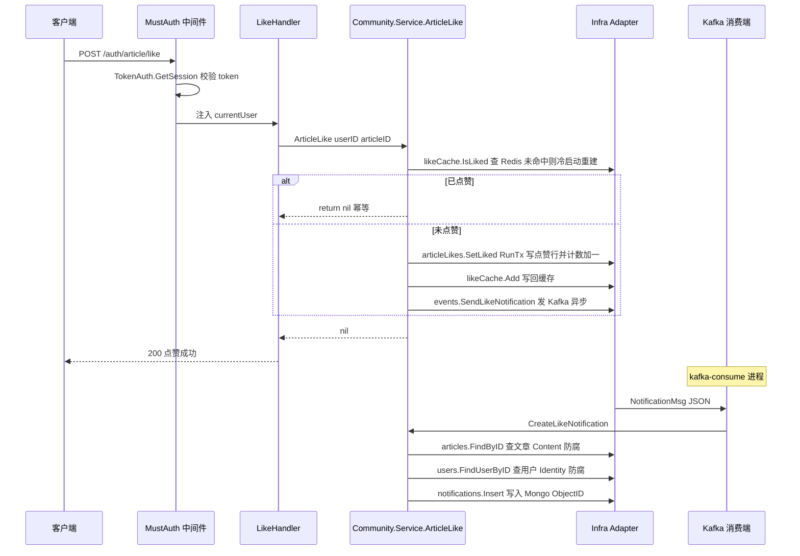

# DDD 实践

本文档记录博客系统在阶段一“DDD 改良严格四层架构”中实际落地的领域驱动设计。内容按**层**组织：用户接口层、应用层、领域层、基础设施层；每个上下文（Identity / Content / Community）的对应产物分别归入所属的层，便于按职责边界阅读与核对。

> **阅读约定**
> - 「Port」指领域层定义的接口；「Adapter」指基础设施层对 Port 的实现。
> - 「代码位置」以仓库根目录为基准，标注了文件名的条目可直接在对应文件中核对。
> - 工作区已出现阶段二脚手架（`services/`、`shared/`），本文描述以阶段一代码布局为准，演进状态见第 7 节。

## 1. 总览

系统采用严格四层架构：

```text
Interfaces → Application → Domain
Infrastructure → 实现 Domain 定义的 Port
```

各层职责与约束：

| 层 | 职责 | 约束 |
| --- | --- | --- |
| 用户接口层（Interfaces） | HTTP/gRPC 入口、Kafka 消费端；协议转换、鉴权、参数校验 | 不直接访问 Repository |
| 应用层（Application） | 业务用例编排、幂等与一致性协调 | 只依赖领域层的 Port 与模型，不感知技术框架 |
| 领域层（Domain） | 聚合、实体、值对象、领域规则、领域事件、Port 定义 | 不导入 GORM/Redis/MongoDB/Kafka/MinIO/Gin 等框架 |
| 基础设施层（Infrastructure） | 实现领域层定义的 Port | 所有外部依赖的适配点 |

> 所有 Port 均由**领域层**定义：应用层「消费」Port（在用例中调用），基础设施层「实现」Port（提供 Adapter）；应用层不定义自己的 Port。

业务按未来微服务边界拆成 3 个界限上下文，通知作为 Community 内部子模块：

| 界限上下文 | 目录 | 未来服务 |
| --- | --- | --- |
| Identity（身份与账号） | `internal/domain/identity` | `services/identity` |
| Content（文章内容） | `internal/domain/content` | `services/content` |
| Community（互动与通知） | `internal/domain/community` | `services/community` |

跨层共享内容放在 `internal/common` 与 `shared/platform`；各领域 Port 定义在对应 `internal/domain/*/ports.go`。阶段一不拆分进程，但代码依赖边界已经按三个上下文隔离。

## 2. 界限上下文与上下文映射

```text
                    ┌─────────────────────┐
                    │  统一 HTTP / gRPC 入口 │
                    │  (用户接口层)        │
                    └─────────┬───────────┘
                              │
      ┌───────────────┬───────┴───────┬───────────────┐
      ▼               ▼               ▼
┌──────────┐   ┌──────────┐   ┌──────────────┐
│ Identity │◄──│ Content  │◄─ │  Community   │
│          │   │          │   │(含 Notification)│
└──────────┘   └──────────┘   └──────────────┘
      │               │               │
      ▼               ▼               ▼
   GORM/Redis      GORM/MinIO      MySQL/MongoDB/Redis/Kafka
```

上下文之间不直接依赖对方 Repository，跨上下文协作只通过「只读查询 Port」进行：

| 调用方 | 被调用方 | 防腐接口 | 阶段一实现 | 阶段二实现 |
| --- | --- | --- | --- | --- |
| Content | Community | `ArticleInteractionQuery.IsUserLikedArticle` | Community 应用层服务（`community.Service.IsUserLikedArticle` 直接满足该接口） | Community gRPC Client |
| Community | Content | `ArticleQuery.FindByID / GetHotListByIDs / GetTopHotArticles` | 基础设施层 Adapter（`internal/infrastructure/community/article_user_queries.go`，直接持有 GORM） | Content gRPC Client |
| Community | Identity | `UserInfoQuery.FindUserByID` | Identity gRPC Client（`internal/interfaces/grpc/client/user_info.go`） | Identity gRPC Client |

说明：

- `ArticleQuery` 由基础设施层 Adapter 直接持有 GORM 实现；`UserInfoQuery` 由 Identity gRPC Client 实现；`ArticleInteractionQuery` 则由 Community 的应用层服务直接实现，未单独编写 Adapter。
- 三条接口的签名在阶段二保持不变，替换为 gRPC Client 时不需要改动领域层/应用层。

## 3. 用户接口层（Interfaces）

### 3.1 职责与约束

- 职责：接收外部请求（HTTP / 开放 gRPC / Kafka 消息），做协议转换、鉴权、参数校验，然后调用应用层用例。
- 约束：不直接访问 Repository，不包含业务规则；只做入口适配。
- 代码位置：`internal/interfaces/{http,grpc,mq}/`。

### 3.2 HTTP 入口

代码位置：`internal/interfaces/http/`。

#### 路由分组（`routes/main_route.go`）

| 分组 | 路径 | 中间件 | 内容 |
| --- | --- | --- | --- |
| public | `/` | 全局 Logger + Error | 注册、登录、公开文章/评论列表、热榜 |
| private | `/auth/*` | + `MustAuth` | 登录用户：评论创建/删除、点赞、通知、我的资料、改密、头像 |
| admin | `/admin/*` | + `MustAuth` + `AdminCheckMiddleware` | 管理员：文章管理、评论管理 |
| optional | `/optional/*` | + `OptionalAuth` | 登录与否有区别：文章详情 + 浏览历史 |

#### Handler（`handler/`）

| Handler | 文件 | 负责 |
| --- | --- | --- |
| `UserAuthHandler` | `user_auth_handler.go` | 注册、登录 |
| `UserHandler` | `user_handler.go` | 我的资料、改密、头像、退出 |
| `ArticleHandler` | `article_handler.go` | 文章 CRUD、列表、详情、图片凭证 |
| `CommentHandler` | `comment_handler.go` | 评论列表、创建、删除 |
| `LikeHandler` | `like_handler.go` | 文章/评论点赞、取消点赞 |
| `NotificationHandler` | `notification_handler.go` | 通知列表、未读统计、一键已读 |

#### 中间件（`middleware/`）

| 中间件 | 文件 | 作用 |
| --- | --- | --- |
| `LoggerMiddleware` | `logger_middleware.go` | 请求日志 |
| `GlobalErrorMiddleware` | `error_middleware.go` | 统一错误响应 |
| `MustAuth` / `OptionalAuth` | `auth_middleware.go` | Token 校验（必选 / 可选），注入 `currentUser` |
| `AdminCheckMiddleware` | `admin_check_middleware.go` | 管理员角色校验 |
| `DuplicateMitigation` | `duplicate_middleware.go` | 防重复提交 |
| `ViewHistoryMiddleware` | `view_history_middleware.go` | 文章详情后异步发送浏览历史事件 |

### 3.3 gRPC 入口（开放 gRPC，二方/三方服务）

代码位置：`internal/interfaces/grpc/`，启动入口 `cmd/grpc.go`。

- 服务端装配（`server/main.go`）：拦截器链 = `LoggingInterceptor` + `NewAuthInterceptor(rdb, partners)`（二方 JWT / 三方 HMAC）。
- 对外服务与 Handler：

| 服务 | Handler | 方法 |
| --- | --- | --- |
| `UserService` | `handler/user_handler.go` | `GetUserBasicInfo`、`GetPublicUserInfo` |
| `CommentService` | `handler/comment_handler.go` | `GetCommentStats` |
| `ArticleService` | `handler/article_handler.go` | `GetAvailableList` |

### 3.4 Kafka 消费端

代码位置：`internal/interfaces/mq/`，启动入口 `cmd/kafka_consume.go`。

| Topic | Handler | 回调应用层用例 |
| --- | --- | --- |
| `notification` | `NewNotificationHandler` | `CreateLikeNotification`（生成点赞通知） |
| `view_history` | `NewViewHistoryHandler` | `CreateViewHistory`（写浏览历史 + 自增浏览量） |

消费端只做消息反序列化，再调用应用层用例，不直接访问 Repository。

## 4. 应用层（Application）

### 4.1 职责与约束

- 职责：编排业务用例、维护幂等与一致性、做跨 Port 的协调（如“主流程 + 计数联动”由应用层发起、事务边界在基础设施层）。
- 约束：只依赖领域层 Port 与模型；不导入任何技术框架（GORM/Redis/Gin/Kafka 等）；不定义自己的 Port。
- 代码位置：`internal/application/{identity,content,community}/`。

### 4.2 Identity 应用用例

代码位置：`internal/application/identity/service.go`。

| 分类 | 用例 |
| --- | --- |
| 账号 | `Register`、`Login`、`Logout`、`UpdateAccount` |
| 资料 | `GetMyProfile`、`GetUserProfile`、`UpdateProfile`、`GetUserBasicInfo`、`ListUserBasicInfo` |
| 改密 | `VerifyOldPassword`（签发一次性凭证）、`UpdatePassword`、`ChangePassword`（消费凭证并踢掉其他会话） |
| 头像 | `GetAvatarUploadURL`（预签名上传）、`ConfirmAvatar`（回填头像地址） |

### 4.3 Content 应用用例

代码位置：`internal/application/content/service.go`。

| 分类 | 用例 |
| --- | --- |
| 文章生命周期 | `CreateArticle`、`UpdateArticle`、`PublishArticle`、`DeleteArticle`（软删）、`RecoverArticle`（恢复）、`ClearArticle`（硬删） |
| 查询 | `GetPublishedArticle`、`GetArticle`、`GetPublishedList`、`GetAdminList`、`GetAvailableList` |
| 图片 | `GetUploadURL`（上传凭证）、`PromoteImages`（图片转正，应用层方法，见下） |

> `PromoteImages` 目前是应用层方法：它同时涉及对象存储 Port（`ArticleImageStorage`）与文章持久化编排（`ArticleRepository`），尚未下沉为领域服务；文章状态流转规则已放入领域层聚合方法。

### 4.4 Community 应用用例

代码位置：`internal/application/community/{comments,likes,views,rank,notifications}.go`。

| 分类 | 用例 |
| --- | --- |
| 评论 | `CreateComment`、`ListRootComments`、`ListReplies`、`DeleteComment`（支持管理员覆盖） |
| 点赞 | `ArticleLike`、`ArticleCancelLike`、`CommentLike`、`CommentCancelLike`、`IsUserLikedArticle` |
| 浏览 | `SendViewHistory`（入口发送事件）、`CreateViewHistory`（消费端落库+计数） |
| 热榜 | `GetHotRank`、`RebuildHotRank` |
| 通知 | `GetMyNotifications`、`GetUnreadCount`、`ClearUnread`、`CreateLikeNotification`（消费端生成通知） |

### 4.5 幂等与一致性协调

- 点赞/取消点赞：应用层先查缓存状态（`LikeCache.IsLiked`），已点赞/未点赞则直接返回，不重复写库；写库成功后写回缓存（失败仅记日志）。
- 浏览统计：游客只增加计数，登录用户额外记录浏览历史（由消费端 `CreateViewHistory` 实现）。
- 通知规则：发送者与接收者相同时不产生通知（`sendNotification` 内判断）。

## 5. 领域层（Domain）

### 5.1 职责与约束

- 职责：承载聚合、实体、值对象、领域规则、领域事件，并定义 Repository / 外部资源 / 事件发布的 Port。
- 约束：不导入任何技术框架；Port 只声明接口，不包含实现。
- 代码位置：`internal/domain/{identity,content,community}/`，各领域 Port 定义在各自 `ports.go`。

### 5.2 Identity 上下文

代码位置：`internal/domain/identity/`。

#### 聚合与实体

| 类型 | 名称 | 说明 | 代码位置 |
| --- | --- | --- | --- |
| 聚合根 | `User` | 用户账号，包含手机号、昵称、密码哈希、角色、状态、登录信息 | `user.go` |
| 实体 | `Session` | 一次登录会话，包含用户 ID、角色、登录时间、IP、设备 | `session.go` |

#### 值对象与领域规则

- 密码哈希：`pbkdf2$迭代次数$盐值$哈希`，由 `HashPassword`/`VerifyPassword` 承载（`password.go`）。
- 角色：`RoleUser=1`、`RoleAdmin=2`。
- 用户状态：`StatusNormal=1`、`StatusDeleted=2`。
- 聚合根规则：`IsAdmin()`、`IsNormal()`。

#### Port（`ports.go`）

| Port | 能力 |
| --- | --- |
| `UserRepository` | 用户持久化 |
| `TokenSession` | 登录会话的创建、查询、删除、多端退出 |
| `PasswordChangeTokenStore` | 一次性改密凭证签发与消费 |
| `AvatarObjectStorage` | 头像对象存储 |

#### 领域服务

当前密码哈希/校验以领域包函数形式提供（`identity.HashPassword`/`VerifyPassword`），尚未建模为显式的 `PasswordService` struct；`internal/auth` 已改为委托这些函数。

### 5.3 Content 上下文

代码位置：`internal/domain/content/`。

#### 聚合与实体

| 类型 | 名称 | 说明 | 代码位置 |
| --- | --- | --- | --- |
| 聚合根 | `Article` | 文章，包含作者、标题、正文、标签、状态和统计字段 | `article.go` |
| 查询模型 | `ArticleWithAuthor` | 文章详情所需的文章字段 + 作者昵称/头像/IP | 同文件 |

#### 值对象与领域规则

- 文章状态：`Deleted=1`、`Draft=2`、`Published=3`；`All=-2`、`AllExceptDeleted=-1` 用于列表过滤。
- 聚合根规则：
  - `IsDeleted()`、`IsPublished()`、`IsDraft()`、`IsPubliclyVisible()`
  - `CanEdit(userID)`、`CanDelete(userID)`、`CanPublish(userID)` —— 仅校验「作者本人」
  - `SoftDelete()`、`Publish()`、`Recover()`

> 注意：管理员对文章的管理权限**不在领域规则中**，而是由用户接口层路由通过 `/admin` 分组 + `AdminCheckMiddleware` 守卫（见 `internal/interfaces/http/routes/main_route.go`）。

#### Port（`ports.go`）

| Port | 能力 |
| --- | --- |
| `ArticleRepository` | 文章 CRUD、游标/偏移分页、按状态计数、带作者查询 |
| `ArticleImageStorage` | 文章图片上传凭证与转正 |
| `ArticleInteractionQuery` | 点赞状态只读查询（由 Community 提供） |

### 5.4 Community 上下文

代码位置：`internal/domain/community/`。

#### 聚合与实体

| 类型 | 名称 | 说明 | 代码位置 |
| --- | --- | --- | --- |
| 聚合根 | `Comment` | 主评论或楼中楼回复，含根评论 ID、被回复人、状态与统计 | `comment.go` |
| 实体 | `ViewHistory` | 浏览历史流水 | `view_history.go` |
| 聚合根 | `Notification` | 通知聚合，含接收者、发送方、类型、已读状态、内容 | `notification.go` |
| 持久化记录（未建模为领域实体） | `ArticleLike` / `CommentLike` | 点赞记录。领域层只有 `LikeStatus*` 常量与 Port，以标量参数 `(userID, targetID, liked)` 表达；GORM 模型位于 `internal/model`，不暴露给领域层 | `like.go`、`ports.go` |

> 说明：`ArticleLike` / `CommentLike` 目前只是「经 Port 访问的持久化记录」，还不是真正的领域实体；若后续需要承载点赞时间、来源等业务规则，可再下沉为实体。

#### 值对象

- `NotifySender`：通知发送方公开信息（用户 ID、昵称、头像）。
- `LikeArticleContent`：点赞文章通知内容（文章 ID、标题）。
- `HotRankItem`：热榜条目（文章 ID、标题、热度、统计字段）。
- `CommentWithUser`：评论列表所需的作者/被回复者画像。

#### 领域规则

- 评论层级：`RootID==0` 为主评论，否则为回复；回复必须存在且未删除的主评论。
- 评论权限：`BelongsTo(userID)`；管理员可覆盖（`DeleteComment` 的 `isAdmin` 参数）。
- 点赞幂等：`LikeStatusLiked=1`、`LikeStatusCanceled=2`；重复点赞/取消不重复写库。
- 浏览统计：游客只增加计数，登录用户额外记录浏览历史。
- 热榜公式：`热度 = 浏览量 + 点赞数 + 评论数`（`CalcHotScore`）。
- 通知规则：发送者与接收者相同时不产生通知。

#### Port（`ports.go`）

| Port | 能力 |
| --- | --- |
| `CommentRepository` | 评论创建、查询、删除，包含计数联动 |
| `ArticleLikeRepository` / `CommentLikeRepository` | 点赞状态与点赞用户集合 |
| `ViewHistoryRepository` | 浏览历史与浏览量计数 |
| `NotificationRepository` | 通知写入、分页查询、未读统计、一键已读 |
| `ArticleQuery` / `UserInfoQuery` | 跨上下文只读查询（防腐层） |
| `LikeCache` | 点赞状态缓存与冷启动重建 |
| `LikeCountStore` | 评论点赞数读取 |
| `HotRankStore` | 热榜 ZSet 读写 |
| `EventPublisher` | 通知与浏览历史异步事件发布 |

#### 领域事件

| 事件 | 字段 | 用途 |
| --- | --- | --- |
| `NotificationEvent` | 通知类型、发送者 ID、目标 ID、发生时间 | 点赞通知异步处理 |
| `ViewHistoryEvent` | 文章 ID、用户 ID、发生时间 | 浏览历史异步处理 |

事件由 `EventPublisher` 适配到 Kafka，消费端在 `internal/interfaces/mq`。当前事件未包含事件 ID 与版本字段，属于阶段二扩展项。

### 5.5 通用 Port 说明

早期 `internal/domain/ports` 中的通用标记接口（`Repository`、`EventPublisher`、`UnitOfWork`、`ObjectStorage`）未被实际引用，已随横向 repository 收敛移除；当前各领域 Port 定义在对应 `internal/domain/{identity,content,community}/ports.go`。

### 5.6 聚合设计总结

| 聚合根 | ID | 不变式 | 跨聚合协作 |
| --- | --- | --- | --- |
| `User` | `ID` | 手机号唯一、正常状态才可登录、改密后其他会话失效（仅 `ChangePassword` 一次性凭证路径；`UpdatePassword` 不踢会话且当前未挂路由） | 会话、改密凭证、头像存储 |
| `Article` | `ID` | 草稿/已删除不可公开；作者可管理（`CanEdit/CanDelete/CanPublish` 仅校验作者，管理员守卫在用户接口层路由）；图片转正后落正式路径 | 作者画像、点赞状态 |
| `Comment` | `ID` | 回复必须挂在有效主评论；删除主评论级联软删回复；评论计数联动 | 文章计数、用户画像、点赞数 |
| `Notification` | Mongo `ObjectID` | 自触发不通知；接收者只能访问自己的通知 | 文章/用户只读查询 |

### 5.7 领域服务现状

当前显式建模的领域服务主要是纯函数：

- `identity.HashPassword` / `identity.VerifyPassword`
- `community.CalcHotScore`

业务用例编排（注册登录、文章生命周期、评论创建、点赞、通知生成、热榜重建）位于应用层。后续若出现“跨多个聚合、不适合放在单一聚合上的规则”，可把 `PasswordService`、`NotificationRuleService` 等显式建模为领域服务。

## 6. 基础设施层（Infrastructure）

### 6.1 职责与约束

- 职责：实现领域层定义的 Port，承载所有外部依赖（GORM、Redis、MongoDB、Kafka、MinIO）的适配。
- 约束：所有第三方客户端初始化、事务边界、消息收发都在本层；领域层/应用层不感知。
- 代码位置：`internal/infrastructure/{identity,content,community}/`、`internal/infrastructure/{bootstrap,config}/`。

### 6.2 配置与客户端初始化

| 文件 | 作用 |
| --- | --- |
| `internal/infrastructure/bootstrap/bootstrap.go` | 配置加载、MySQL/MongoDB/Redis/Kafka/MinIO 客户端初始化、Validator、IP 离线库 |
| `internal/infrastructure/config/` | 配置结构定义与加载、Kafka 配置 |

### 6.3 Identity Adapter（`internal/infrastructure/identity/`）

| 文件 | 实现 Port |
| --- | --- |
| `user_repository.go` | `UserRepository`（GORM） |
| `token_session.go` | `TokenSession`（Redis，包装 `internal/auth`） |
| `password_change_token_store.go` | `PasswordChangeTokenStore`（Redis） |
| `avatar_storage.go` | `AvatarObjectStorage`（MinIO） |

### 6.4 Content Adapter（`internal/infrastructure/content/`）

| 文件 | 实现 Port |
| --- | --- |
| `article_repository.go` | `ArticleRepository`（GORM） |
| `article_image_storage.go` | `ArticleImageStorage`（MinIO，预签名与转正） |

### 6.5 Community Adapter（`internal/infrastructure/community/`）

| 文件 | 实现 Port |
| --- | --- |
| `comment_repository.go` | `CommentRepository`（GORM，创建/删除含计数联动事务） |
| `like_repositories.go` | `ArticleLikeRepository` / `CommentLikeRepository`（GORM，写点赞行 + 计数在 `database.RunTx` 内） |
| `like_cache.go` | `LikeCache` / `LikeCountStore`（Redis，含冷启动重建与分布式锁） |
| `hot_rank_store.go` | `HotRankStore`（Redis ZSet） |
| `view_history_repository.go` | `ViewHistoryRepository`（GORM） |
| `notification_repository.go` | `NotificationRepository`（MongoDB，ID 为 ObjectID） |
| `event_publisher.go` | `EventPublisher`（Kafka 异步发送） |
| `article_user_queries.go` | `ArticleQuery`（跨上下文只读查询，直接持有 GORM） |

### 6.6 跨上下文防腐实现

| 调用方上下文 | 被调用方 | 防腐接口 | 阶段一实现方式 |
| --- | --- | --- | --- |
| Content | Community | `ArticleInteractionQuery.IsUserLikedArticle` | Community 应用层服务（`community.Service`） |
| Community | Content | `ArticleQuery.FindByID / GetHotListByIDs / GetTopHotArticles` | 基础设施层 Adapter（`article_user_queries.go`，直接持有 GORM） |
| Community | Identity | `UserInfoQuery.FindUserByID` | Identity gRPC Client（`internal/interfaces/grpc/client/user_info.go`） |

数据访问已收敛为标准形态：各领域基础设施 Adapter 直接持有 GORM/MongoDB，横向 `internal/repository` 已移除；跨上下文防腐在阶段二切换为 gRPC Client，接口签名不变。

### 6.7 事务与异步一致性边界

- 事务边界：评论创建/删除、点赞写入等“主流程 + 计数联动”使用 `database.RunTx`/GORM 事务，边界位于本层 Adapter（`comment_repository.go`、`like_repositories.go`）。
- 异步一致性：阶段一不引入 Outbox、事务消息或分布式事务框架；通知与浏览统计通过 Kafka 异步处理，主流程不等待异步结果。
- 幂等：重复点赞/取消点赞由应用层先查缓存状态再写库（见 4.5）。

## 7. 待完善与演进

- Kafka 事件增加事件 ID、事件类型、版本、发生时间与业务主键，消费端做幂等、重试和死信。
- 评论/回复通知用例接入生产路径，目前只实现了点赞文章通知。
- 将 `PasswordService`、通知规则等领域服务显式建模。
- 阶段二以 gRPC Client 作为新的防腐层替换共享单体 Adapter。
- 物理数据库拆分后，`Article` 上的互动统计字段将由 Community 统计读模型替代。
- 阶段二脚手架已开始搭建（`services/{identity,content,community}` 服务目录、`shared/contracts` 内部 gRPC proto 与事件信封、`shared/platform` 配置/日志/Trace/错误/客户端），迁移过程中不影响阶段一代码布局。

## 附录 A：一条完整请求链路（点赞文章）

以「用户点赞文章」为例走一遍全链路，覆盖：用户接口层鉴权 → 应用层编排 → 基础设施层 Adapter（Redis 缓存 + GORM 事务 + Kafka 异步）→ 消费端跨上下文防腐查询。



| 步骤 | 层 | 说明 | 代码位置 |
| --- | --- | :-: | --- |
| 1 | 用户接口层 | `POST /auth/article/like` 经 `MustAuth` 校验 token 并注入 `currentUser` | `internal/interfaces/http/routes/like_route.go`、`middleware/auth_middleware.go` |
| 2 | 用户接口层 | `LikeHandler.ArticleLikeHandler` 解析参数并调用用例 | `internal/interfaces/http/handler/like_handler.go` |
| 3 | 应用层 | `Service.ArticleLike` 先查点赞缓存做幂等判断 | `internal/application/community/likes.go` |
| 4 | 基础设施层 | `likeCacheAdapter.IsLiked`：Redis Set 命中；未命中用分布式锁从 DB 重建 | `internal/infrastructure/community/like_cache.go` |
| 5 | 基础设施层 | `articleLikeRepository.SetLiked`：`database.RunTx` 内写/改点赞行并原子更新文章点赞计数 | `internal/infrastructure/community/like_repositories.go` |
| 6 | 基础设施层 | `eventPublisherAdapter.SendLikeNotification` 异步发 Kafka | `internal/infrastructure/community/event_publisher.go` |
| 7 | 用户接口层 | 消费端 `NewNotificationHandler` 反序列化并回调用例 | `internal/interfaces/mq/notification_handler.go` |
| 8 | 应用层 | `CreateLikeNotification` 通过 `ArticleQuery` / `UserInfoQuery` 只读查询文章与用户，构造通知 | `internal/application/community/notifications.go` |
| 9 | 基础设施层 | `notificationRepository.Insert` 写入 MongoDB，ID 为 ObjectID | `internal/infrastructure/community/notification_repository.go` |

> 与之互补的链路是「查看文章详情」：`GET /optional/article/detail` 走 Content 应用层，通过 `ArticleInteractionQuery`（Content ← Community）获取点赞状态，并由 `ViewHistoryMiddleware` 异步发送浏览历史事件（游客只增计数，登录用户额外记录浏览历史）。
